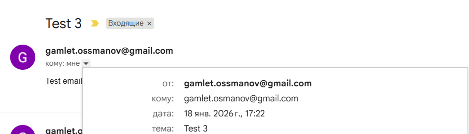
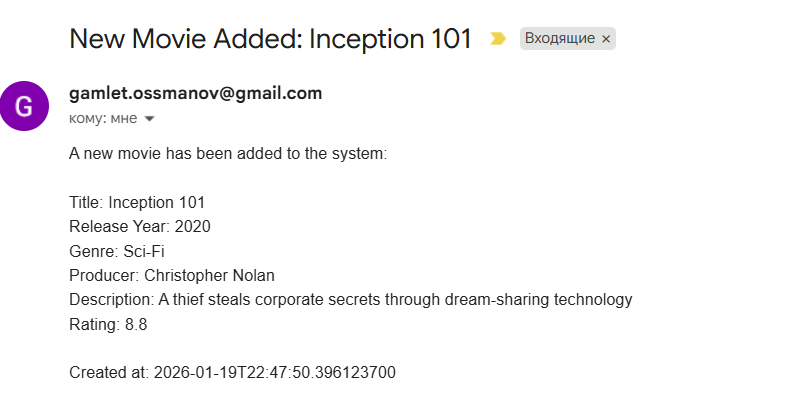

##### 1. Сборка проектов
Перед запуском контейнеров необходимо собрать исполняемые файлы (JAR) для обоих сервисов.
- Email Service (Gradle): Перейдите в директорию email-service и выполните:  
`./gradlew clean buil`
- Backend Service (Maven): Перейдите в директорию Spring Boot and REST API и выполните:  
`mvn clean package`
- Совет: Вы также можете использовать встроенные инструменты IntelliJ IDEA (вкладки Maven и Gradle в правой части экрана).
##### 2. Конфигурация Gmail SMTP.
Для корректной работы рассылки писем:

1. Включите двухэтапную верификацию в вашем Google-аккаунте.
2. Перейдите в App Passwords.
3. Создайте пароль для приложения (назовите его произвольно, например "Java App").
4. Замена данных: В файлах конфигурации измените:
   - gamlet.ossmanov@gmail.com — на вашу почту-отправитель.
   - gamlet.osmanov@gmail.com — на вашу почту-получатель.
   - Используйте сгенерированный пароль в переменных окружения или файле .env.

##### 3. Запуск инфраструктуры (Docker)

- Запустите все необходимые компоненты одной командой из корневой папки проекта:
`docker-compose up -d`

- Запускаем docker.compose.yml подождите пока все сервисы установляться, а после можете запускать EmailServiceApplication и SpringBootAndRestApiApplication. 
Сервисы можно также вручную запускать=) Например, для elasticsearch ` docker run -d --name elasticsearch -p 9200:9200 -p 9300:9300 -e "discovery.type=single-node" -e "xpack.security.enabled=false" elasticsearch:8.17.10`

#### 4. API и Тестирование.
- Для отправки простого письма с email-serivce
POST  http://localhost:8081/api/emails/send
  {
  "ownerRef": "Hamlet",
  "emailFrom": "gamlet.ossmanov@gmail.com",
  "emailTo": "gamlet.osmanov@gmail.com",
  "subject": "Test 3",
  "text": "Test email"
  }
то есть после выполнения запроса приходит письмо на gamlet.osmanov@gmail.com
  
- Для добавления сущности №1 и 2
POST  http://localhost:8080/api/producers
{
"name": "Wigram",
"country": "UK"
}

POST  http://localhost:8080/api/movies
  {
  "title": "Sherlock Holmes 2",
  "releaseDate": 2011,
  "producerId": 1,
  "genre": "Sci-Fi",
  "description": "Sherlock Holmes and his sidekick Dr. Watson join forces to outwit and bring down their fiercest adversary, Professor Moriarty",
  "rating": 7.4
  }
то есть после выполнения запроса приходит, (условному админу),что был добавлен фильм.

примечания.
Также,доступен интрефейс сваггера для выполнения операции с сущностями http://localhost:8080/swagger-ui/index.html
Если вам надо настроить или подсмотреть БД из задания №2,то вот данные.
`spring.datasource.username=postgres
spring.datasource.password=hamletnadirian
spring.datasource.url=jdbc:postgresql://localhost:5432/movies_db
` ссылка на README.md задание 2,если вам надо подсмотреть  https://github.com/HamletNadirian/AdvancedJavaBackend/tree/master/Spring%20Boot%20and%20REST%20API